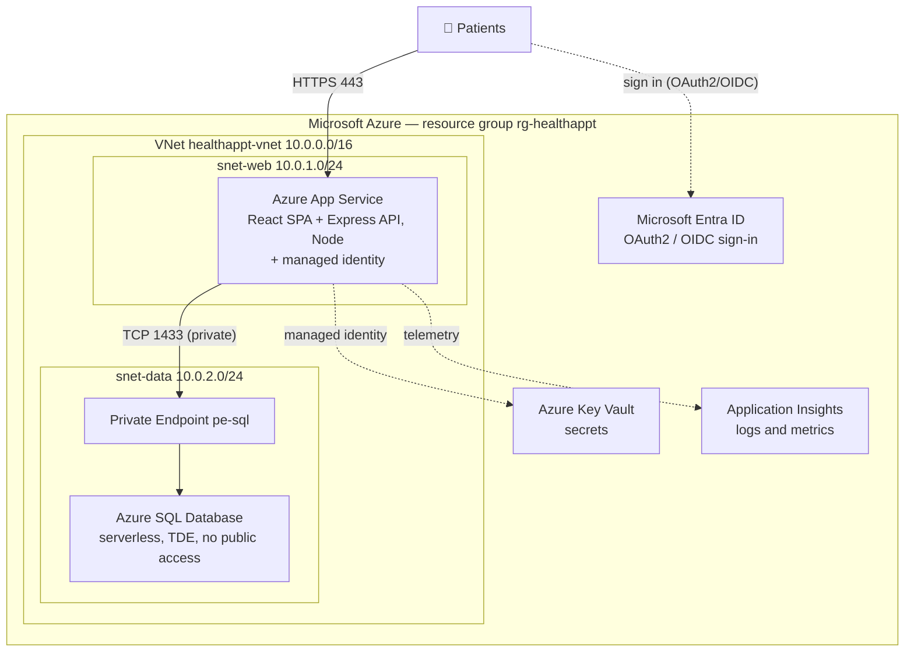

# 🏥 Healthcare Appointment System on Azure


A cloud-native **healthcare appointment management system** deployed on **Microsoft Azure**. Patients sign in with Microsoft Entra ID, browse providers, and book or cancel appointments; providers get a schedule dashboard. The app runs as a React SPA served by an Express API on Azure App Service, backed by a private Azure SQL Database — with no secrets in code (managed identity + Key Vault).

> ⚠️ **Live demo is currently offline.** The Azure resources were deprovisioned to avoid ongoing cloud costs, so there is no public URL at the moment. The architecture, source, screenshots-in-slides, and presentation below document the working system.

## Contents

- [Architecture](#architecture)
- [How it works](#how-it-works)
- [Tech stack](#tech-stack)
- [Repository structure](#repository-structure)
- [Running locally](#running-locally)
- [Security](#security)
- [Documentation](#documentation)

## Architecture



## How it works

1. A patient opens the site and **signs in** — Microsoft Entra ID returns an OAuth2/OIDC token.
2. The browser calls the app over **HTTPS 443** → **Azure App Service** (React front end + Express API).
3. App Service **validates the token**, then reaches the database on **TCP 1433** through a **Private Endpoint** → **Azure SQL Database** (fully private, inside the VNet).
4. App Service reads secrets from **Key Vault** using its **managed identity** — no passwords in code.
5. App Service streams logs & metrics to **Application Insights**.

## Tech stack

| Layer | Technologies |
|---|---|
| **Frontend** | React 18, Vite, MSAL (`@azure/msal-react`), React Router |
| **Backend** | Node.js, Express, `mssql`, `jsonwebtoken` + `jwks-rsa` (Entra token validation), Helmet, `@azure/identity` |
| **Database** | Azure SQL Database (private endpoint, TDE) |
| **Identity** | Microsoft Entra ID (two app registrations: SPA + API) |
| **Cloud** | Azure App Service, VNet + subnets + NSGs, Key Vault, Application Insights, Managed Identity |

## Repository structure

```
Healthcare-Appointment-Azure/
│
├── healthappt-backend/       # Express REST API (Node.js)
│   ├── src/
│   │   ├── auth.js               # Verifies the Entra sign-in token per request
│   │   ├── db.js                 # Azure SQL (password locally, managed identity in Azure)
│   │   └── routes/               # me, providers, appointments
│   ├── db/schema.sql             # Tables + sample data
│   ├── server.js
│   └── .env.example
│
├── healthappt-frontend/      # React + Vite single-page app
│   ├── src/
│   │   ├── pages/                # Home, Book, MyAppointments, Provider, Profile
│   │   ├── components/           # NavBar, AuthGate
│   │   ├── authConfig.js         # MSAL config (reads Entra IDs from env)
│   │   └── api.js                # useApi() — attaches the access token
│   └── .env.example
│
├── Architecture Diagram - Draw It Professionally.md   # Azure architecture blueprint
├── Cloud Computing - Project Plan ... .pptx           # Project plan deck
├── Healthcare on Azure - Final Project Presentation (COMPLETE).pptx
└── updated GKDM.png
```

## Running locally

Each part has its own detailed README. In short:

**Backend** (`healthappt-backend`)
```bash
npm install
cp .env.example .env      # fill in Azure SQL + Entra values
npm run dev               # http://localhost:8080/api/health
```

**Frontend** (`healthappt-frontend`)
```bash
npm install
cp .env.example .env      # set VITE_API_BASE=http://localhost:8080/api
npm run dev               # http://localhost:5173
```

See [`healthappt-backend/README.md`](healthappt-backend/README.md) and [`healthappt-frontend/README.md`](healthappt-frontend/README.md) for full steps.

## Security

- **No secrets in the repo.** Real values live only in local `.env` files (git-ignored); `.env.example` templates show the shape. In Azure, the app uses its **managed identity** instead of passwords.
- The database has **no public access** — it is reached only through a private endpoint from the web subnet.
- Every API request is authenticated against **Microsoft Entra ID** before touching data.

## Documentation

- **Architecture blueprint:** [`Architecture Diagram - Draw It Professionally.md`](Architecture%20Diagram%20-%20Draw%20It%20Professionally.md)
- **Final presentation:** `Healthcare on Azure - Final Project Presentation (COMPLETE).pptx`
- **Project plan:** `Cloud Computing - Project Plan - Healthcare Appointment System (Azure).pptx`
